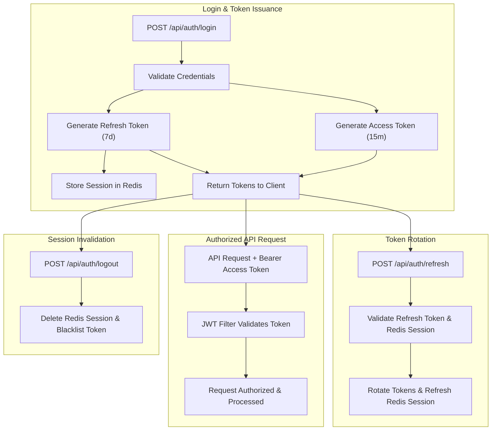

# 🔗 URL Shortener Backend (Spring Boot 3)

[](https://www.oracle.com/java/)
[](https://spring.io/projects/spring-boot)
[](https://spring.io/projects/spring-security)
[](https://www.postgresql.org/)
[](https://redis.io/)
[](https://www.docker.com/)
[](http://localhost:8080/swagger-ui.html)

A production-ready, highly available RESTful URL Shortener backend service built with **Java 21**, **Spring Boot 3**, **Spring Security 6**, **PostgreSQL**, **Redis**, **JWT Authentication**, **Maven**, **Lombok**, and **OpenAPI/Swagger**.

---

## 🌟 Key Features

### 🔐 Authentication & Session Management
- **Stateless JWT Tokens**: Short-lived access tokens (15 minutes) and long-lived refresh tokens (7 days).
- **Redis Session Management**: State management for refresh tokens stored in Redis with full token rotation support.
- **Session Control**: Supports logging out single sessions or revoking all sessions across devices (`logout-all`).
- **Account Endpoints**: Email-based registration, login, and user profile (`/api/auth/me`).

### 🌐 URL Management & Real-Time Analytics
- **Full CRUD Operations**: Create, read, update, delete, and list owner-scoped URLs.
- **Pagination & Search**: List URLs with dynamic pagination, sorting, and search filtering.
- **Fast Redirection**: High-performance HTTP 302 redirect lookup using unique short codes.
- **Rich Analytics**: Tracks total click counts, last access timestamps, device OS, browser user-agents, client IP addresses, and daily click rollups.
- **JPA Auditing**: Automatic creation and update timestamps (`createdAt`, `updatedAt`).

### 🛡️ Resilience & Standards
- **Standardized API Envelope**: All REST responses follow a uniform `ApiResponse<T>` wrapper.
- **Global Error Handling**: Comprehensive validation annotations and centralized exception handler.
- **OpenAPI & Swagger Documentation**: Auto-generated interactive API UI at runtime.
- **Containerization**: Full Docker Compose setup for PostgreSQL, Redis, and Spring Boot.

---

## 🏗️ Architecture & Workflows

### Authentication & Token Lifecycle Flow



---

## 📁 Directory Structure

```text
src/
├── main/
│   ├── java/com/url/shortener/
│   │   ├── config/          # Security, Redis, JPA Auditing, & OpenAPI configs
│   │   ├── controllers/     # Authentication & URL Management REST Controllers
│   │   ├── dtos/            # Request payloads & API Response Data Transfer Objects
│   │   ├── exception/       # Custom exceptions & Global Exception Handler
│   │   ├── models/          # JPA Entities (User, Url), Enums, & Redis Models
│   │   ├── repo/            # Data Repositories & Specifications for search
│   │   ├── security/        # JWT Filter, Authentication Entrypoints, Security Config
│   │   ├── service/         # Business logic for Auth, URL shortener, & Sessions
│   │   └── util/            # Base62 code generation & user-agent parsers
│   └── resources/
│       └── application.properties # Spring configuration file
docs/
├── database-schema.md       # Complete database ERD and table specifications
└── postman/                # Exported Postman collection for API testing
Dockerfile
docker-compose.yml
```

---

## 🚀 Getting Started

### Prerequisites

Ensure you have the following installed on your local environment:
- **Java 21 JDK** or higher
- **Docker** and **Docker Compose**
- **Maven** (or use the included `./mvnw` wrapper)

---

### 1️⃣ Clone & Configure Environment

Duplicate `.env.example` or create a `.env` file in the project root:

```bash
cp .env.example .env
```

---

### 2️⃣ Run via Docker Compose (Recommended)

To build and run the Spring Boot app alongside PostgreSQL and Redis in containers:

```bash
docker compose up --build -d
```

The application will start on **`http://localhost:8080`**.

To stop the containers:
```bash
docker compose down
```

---

### 3️⃣ Run Locally with Maven

If you prefer running the Spring Boot application locally while starting PostgreSQL & Redis in Docker:

1. **Start database and cache services**:
   ```bash
   docker compose up -d postgres redis
   ```

2. **Compile and build the package**:
   ```bash
   ./mvnw clean package
   ```

3. **Run the Spring Boot app**:
   ```bash
   ./mvnw spring-boot:run
   ```

---

## ⚙️ Environment Variables

| Variable | Description | Default |
|---|---|---|
| `SERVER_PORT` | HTTP port for the Spring Boot application | `8080` |
| `DB_URL` | PostgreSQL JDBC Connection String | `jdbc:postgresql://localhost:5432/url_shortener` |
| `DB_USERNAME` | PostgreSQL database user | `postgres` |
| `DB_PASSWORD` | PostgreSQL database password | `postgres` |
| `REDIS_HOST` | Hostname for Redis instance | `localhost` |
| `REDIS_PORT` | Port for Redis instance | `6379` |
| `REDIS_PASSWORD` | Access password for Redis instance | *(empty)* |
| `APP_BASE_URL` | Base domain/URL used to generate shortened links | `http://localhost:8080` |
| `APP_CORS_ALLOWED_ORIGINS` | Comma-separated list of allowed CORS origins | `http://localhost:3000,http://localhost:8080` |
| `JWT_SECRET` | Base64-encoded secret key for signing JWTs | *(Required in Production)* |

---

## 📖 API Documentation & Testing

### Interactive Swagger UI & OpenAPI

When the service is running, interactively test API endpoints directly in your browser:

- 🌐 **Swagger UI**: [http://localhost:8080/swagger-ui.html](http://localhost:8080/swagger-ui.html)
- 📄 **OpenAPI Specification (JSON)**: [http://localhost:8080/api-docs](http://localhost:8080/api-docs)

### Postman Collection

An updated Postman collection is included in the project for seamless API testing:

- 📬 [docs/postman/url-shortener.postman_collection.json](docs/postman/url-shortener.postman_collection.json)

---

## 📡 REST API Endpoint Summary

### 🔑 Authentication Endpoints (`/api/auth`)

| Method | Endpoint | Description | Auth |
|---|---|---|---|
| `POST` | `/api/auth/register` | Register a new user account | 🔓 Public |
| `POST` | `/api/auth/login` | Authenticate user and issue JWT access/refresh tokens | 🔓 Public |
| `POST` | `/api/auth/refresh` | Obtain a new access token using a valid refresh token | 🔓 Public |
| `POST` | `/api/auth/logout` | Revoke current refresh token session | 🔒 Bearer |
| `POST` | `/api/auth/logout-all` | Revoke all active sessions across all devices | 🔒 Bearer |
| `GET` | `/api/auth/me` | Retrieve profile information for the current user | 🔒 Bearer |

### 🔗 URL Endpoints (`/api/url`)

| Method | Endpoint | Description | Auth |
|---|---|---|---|
| `POST` | `/api/url` | Create a shortened URL from a original URL | 🔒 Bearer |
| `GET` | `/api/url/{id}` | Retrieve URL details and analytics by URL UUID | 🔒 Bearer |
| `PUT` | `/api/url/{id}` | Update original destination URL or active status | 🔒 Bearer |
| `DELETE` | `/api/url/{id}` | Delete a shortened URL | 🔒 Bearer |
| `GET` | `/api/url/my` | Paginated listing of user's URLs with search filter | 🔒 Bearer |
| `GET` | `/{shortCode}` | Public redirect endpoint to destination URL | 🔓 Public |

---

### 📦 Standardized API Response Format

All responses follow a consistent `ApiResponse<T>` envelope structure:

```json
{
  "success": true,
  "message": "Short URL created successfully",
  "data": {
    "id": "d290f1ee-6c54-4b01-90e6-d701748f0851",
    "shortCode": "Ab12Cd34",
    "shortUrl": "http://localhost:8080/Ab12Cd34",
    "originalUrl": "https://google.com",
    "clickCount": 0,
    "createdAt": "2026-07-24T09:00:00Z",
    "updatedAt": "2026-07-24T09:00:00Z",
    "expirationDate": null,
    "lastAccessedAt": null,
    "active": true
  },
  "timestamp": "2026-07-24T09:00:00Z"
}
```

---

## 🗄️ Database Schema

For detailed database table definitions, foreign key constraints, and index details:
- 📖 See [docs/database-schema.md](docs/database-schema.md)

---

## 🚀 Roadmap & Enhancements

- [ ] GeoIP location parsing for click analytics (country/city lookup).
- [ ] Rate-limiting per user/IP on auth and redirect endpoints.
- [ ] Database schema migrations using Flyway or Liquibase.
- [ ] Distributed logging and telemetry with Prometheus and Grafana.
