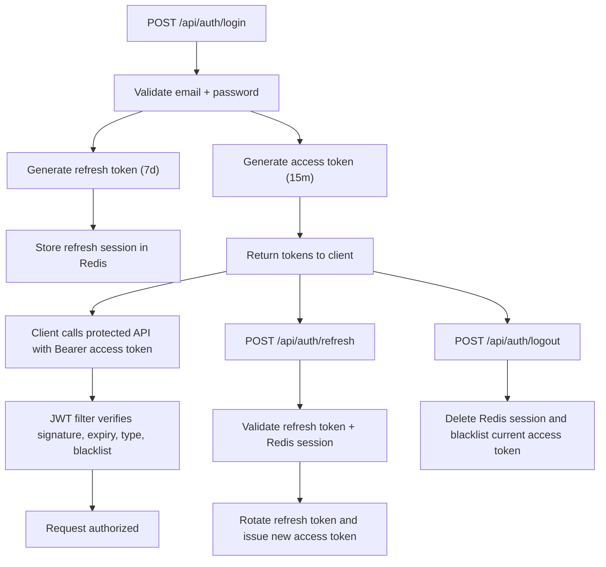

# URL Shortener Backend

Production-ready backend for a URL shortener built with Java 21, Spring Boot 3, Spring Security 6, PostgreSQL, Redis, JWT, Maven, Lombok, Validation, and OpenAPI.

## What Was Completed

- Stateless JWT authentication with access and refresh tokens
- Redis-backed refresh-session management with token rotation
- Logout current session and logout-all support
- Email-based registration and login
- Current-user endpoint
- URL create, redirect, update, delete, analytics, and owner-scoped listing
- URL analytics with click count, last access, browser, OS, IP, country placeholder, and daily rollups
- Auditing with `createdAt` and `updatedAt`
- Consistent API response envelope
- Global exception handling and validation
- OpenAPI and Swagger UI
- Docker Compose for PostgreSQL, Redis, and the Spring Boot app
- Unit, controller, and integration tests

## Architecture

### Main Modules

- `controllers`: auth and URL endpoints
- `service`: auth flow, Redis session lifecycle, URL logic, user lookup
- `security`: JWT handling, filter, entrypoint, security config
- `models`: JPA entities, enum role, Redis session payload
- `repo`: JPA repositories and specifications support
- `config`: JPA auditing, Redis template, app properties, OpenAPI
- `exception`: custom exceptions and global error handling
- `util`: short-code generation and request client parsing
- `dtos`: request and response models

### Authentication Flow



## API Documentation

Swagger UI:
- `http://localhost:8080/swagger-ui.html`

OpenAPI JSON:
- `http://localhost:8080/api-docs`

### Auth Endpoints

- `POST /api/auth/register`
- `POST /api/auth/login`
- `POST /api/auth/refresh`
- `POST /api/auth/logout`
- `POST /api/auth/logout-all`
- `GET /api/auth/me`

### URL Endpoints

- `POST /api/url`
- `GET /api/url/{id}`
- `PUT /api/url/{id}`
- `DELETE /api/url/{id}`
- `GET /api/url/my?page=0&size=10&sortBy=createdAt&direction=desc&search=google`
- `GET /{shortCode}`

### Sample Response

```json
{
  "success": true,
  "message": "Short URL created successfully",
  "data": {
    "id": "d290f1ee-6c54-4b01-90e6-d701748f0851",
    "shortCode": "Ab12Cd34",
    "shortUrl": "http://localhost:8080/Ab12Cd34",
    "originalUrl": "https://google.com",
    "clickCount": 0,
    "createdAt": "2026-07-24T09:00:00Z",
    "updatedAt": "2026-07-24T09:00:00Z",
    "expirationDate": null,
    "lastAccessedAt": null,
    "active": true
  },
  "timestamp": "2026-07-24T09:00:00Z"
}
```

## Database Schema

Schema reference:
- [docs/database-schema.md](/Users/ganesh/Downloads/URL_Shorter/url-shorter-sb/docs/database-schema.md)

## Environment Variables

| Variable | Description | Default |
|---|---|---|
| `SERVER_PORT` | Spring Boot port | `8080` |
| `DB_URL` | PostgreSQL JDBC URL | `jdbc:postgresql://localhost:5432/url_shortener` |
| `DB_USERNAME` | PostgreSQL user | `postgres` |
| `DB_PASSWORD` | PostgreSQL password | `postgres` |
| `REDIS_HOST` | Redis host | `localhost` |
| `REDIS_PORT` | Redis port | `6379` |
| `REDIS_PASSWORD` | Redis password | empty |
| `APP_BASE_URL` | Public base URL for generated links | `http://localhost:8080` |
| `APP_CORS_ALLOWED_ORIGINS` | Comma-separated allowed origins | `http://localhost:3000,http://localhost:8080` |
| `JWT_SECRET` | Base64-encoded signing key | required in production |

See [.env.example](/Users/ganesh/Downloads/URL_Shorter/url-shorter-sb/.env.example).

## Setup Instructions

1. Copy `.env.example` to `.env` and update secrets.
2. Start dependencies with `docker compose up -d postgres redis`.
3. Build the app with `./mvnw clean package`.
4. Run the app with `./mvnw spring-boot:run`.
5. Open Swagger at `http://localhost:8080/swagger-ui.html`.

### Full Container Setup

Run everything together:

```bash
docker compose up --build
```

## Folder Structure

```text
src/
  main/
    java/com/url/shortener/
      config/
      controllers/
      dtos/
      exception/
      models/
      repo/
      security/
      service/
      util/
    resources/
      application.properties
  test/
    java/com/url/shortener/
      controllers/
      service/
    resources/
      application.properties
docs/
  database-schema.md
  postman/
Dockerfile
docker-compose.yml
```

## Postman Collection

- [docs/postman/url-shortener.postman_collection.json](/Users/ganesh/Downloads/URL_Shorter/url-shorter-sb/docs/postman/url-shortener.postman_collection.json)

## Breaking Changes

- Authentication is now email-based instead of username-based.
- Public URL identifiers are now UUIDs instead of numeric IDs.
- Endpoint contracts now match the requested production API shape.
- Response bodies are wrapped in a consistent `ApiResponse` envelope.

## Remaining Optional Enhancements

- Replace the country placeholder with GeoIP resolution
- Add rate limiting on auth and redirect endpoints
- Add Flyway or Liquibase migrations for versioned schema management
- Add observability with request tracing and metrics dashboards
- Add admin-only moderation/reporting endpoints
